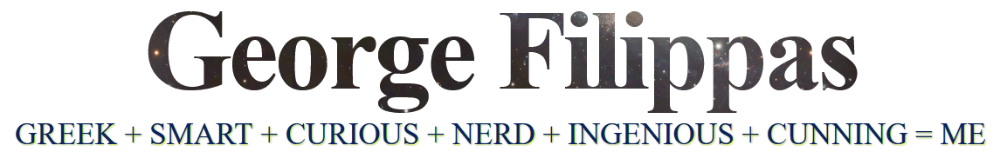

<h2>
	<b> Welcome to my Profile </b> 
</h2>
	

---

  

<h3>
	<b> Interests </b>
</h3>
I am keen on using the internet enough so tha I am constantly informed about new languages and new programming environment from different higher educational institutions. I am also writing articles and working on developing online tools that provide solutions for the Inetrnet and web business companies with new ideas and innovations.

<h3>
	<b> Ambitions </b>
</h3>
I believe that the perfect job doesn't exist in a single business sector. I'm always opting for new working environments that will provide me the opportunity to make good use and even expand further the knowledge and expeerience tha I have gained. Regarding the educational sector, the is the challenge of teaching new technologies to people that aren't as accustomed to the profession that I have chosen. By helping young people I feel like I'm contributing to the social whole.

---

